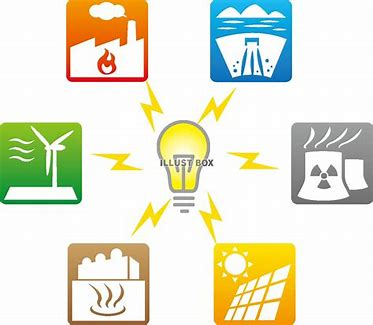
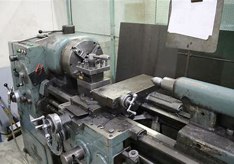

<!DOCTYPE html>
<html lang="ja">
<head>
    <meta charset="UTF-8">
    <meta name="viewport" content="width=device-width, initial-scale=1.0">
    <title>大阪公立大学工業高等専門学校 エネルギー機械コースの紹介</title>
    <link rel="stylesheet" href="styles.css">
</head>
<body>
    <header>
        <h1>大阪公立大学工業高等専門学校 エネルギー機械コース</h1>
    </header>
    <main>
        <section>
            <h2>1. コースの概要</h2>
            
エネルギー機械コースは、現代社会に欠かせないエネルギー分野において、機械工学の知識と技術を身につけることを目指す学科です。持続可能な社会の実現に向けて、再生可能エネルギーやエネルギー効率化など、未来のエネルギー課題に取り組む人材を育成します。

            
        </section>
        <section>
            <h2>2. 学べる内容</h2>
            <ul>
                <li><strong>機械工学基礎</strong>: 機械の設計や製造に関する基礎知識を学びます。</li>
                <li><strong>エネルギー工学</strong>: エネルギーの生成、変換、利用に関する技術を学びます。</li>
                <li><strong>再生可能エネルギー</strong>: 太陽光、風力、水力などの再生可能エネルギーの原理と応用を学びます。<a href="https://www.bing.com/search?q=再生可能エネルギー" target="_blank">[リンク]</a></li>
                <li><strong>電気工学</strong>: エネルギー機械に必要な電気回路や電子工学の基礎を学びます。</li>
                <li><strong>材料力学</strong>: 機械の構造に使用される材料の性質や強度を学びます。</li>
                <li><strong>エネルギー効率</strong>: エネルギーを効率的に利用する技術を学びます。<a href="https://www.bing.com/search?pglt=2083&q=エネルギー効率" target="_blank">[リンク]</a></li>
            </ul>
        </section>
        <section>
            <h2>3. 実習とプロジェクト</h2>
            
実習やプロジェクトを通じて、学んだ理論を実際に応用する経験を積むことができます。

            
            <ul>
                <li><strong>機械加工実習</strong>: 実際に機械を使って部品を製作することで、機械加工技術を習得します。</li>
                <li><strong>エネルギー関連プロジェクト</strong>: 再生可能エネルギーシステムの設計や製作、エネルギー効率の改善など、実践的なプロジェクトに取り組みます。</li>
            </ul>
        </section>
        <section>
            <h2>4. 将来の進路</h2>
            
エネルギー機械コースを修了すると、以下のような進路が考えられます。

            <ul>
                <li><strong>大学進学</strong>: さらに専門的な知識を深めるために、大学の工学部やエネルギー関連学科に進学します。</li>
                <li><strong>就職</strong>: エネルギー関連企業、機械メーカー、電力会社などで技術者として働きます。</li>
                <li><strong>研究開発</strong>: 新しいエネルギー技術の開発や、エネルギー効率化の研究に従事します。</li>
            </ul>
        </section>
        <section>
            <h2>5. コースの魅力</h2>
            
エネルギー機械コースの魅力は、最新のエネルギー技術を学び、実際に手を動かしてものづくりを体験できる点です。持続可能な未来を創るための技術と知識を身につけることができるため、社会に貢献できるやりがいがあります。

        </section>
    </main>
    <footer>
        
興味がある方は、ぜひオープンキャンパスや説明会に参加してみてください！

    </footer>
</body>
</html>
